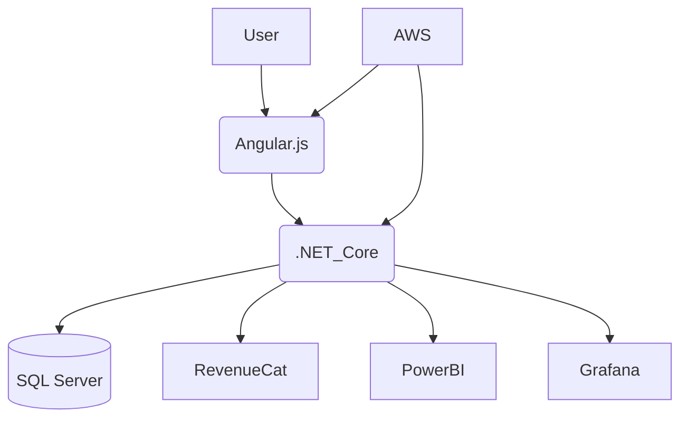

# 🌟 Tarock — Personality Assessment & Social Engagement Platform

Tarock is a dual-version web application built with **C#, .NET Core, AWS**, and **Angular.js**, offering card-based personality assessments, social engagement features, and powerful data insights via **Power BI** and **Grafana** dashboards.

---

## 🚀 Features

- 🧠 **Personality Analysis** — Card-based assessments with 95% accuracy in trait prediction
- 💬 **Social Interaction** — Engage through posts, comments, and multimedia content
- 💳 **RevenueCat Integration** — In-app payments & subscription management
- 📊 **Analytics Dashboard** — Real-time insights with Power BI and Grafana
- ☁️ **Cloud-Ready** — Deployed on AWS for scalability and performance
- 🔒 **Secure & Reliable** — OAuth2 and HTTPS enabled for data protection
- ⚙️ **Agile Development** — Continuous integration and unit testing for stability

---

## 🛠️ Tech Stack

| Category         | Technologies                         |
| ---------------- | ------------------------------------ |
| Frontend         | Angular.js, TypeScript, Tailwind CSS |
| Backend          | C#, .NET Core, REST APIs             |
| Cloud            | AWS (EC2, S3, RDS, Lambda)           |
| Data & Analytics | Power BI, Grafana                    |
| DevOps           | Docker, GitHub Actions, CI/CD        |
| Payments         | RevenueCat API, Webhooks             |
| Database         | SQL Server, Firebase                 |

---

## 🧩 Architecture Overview

